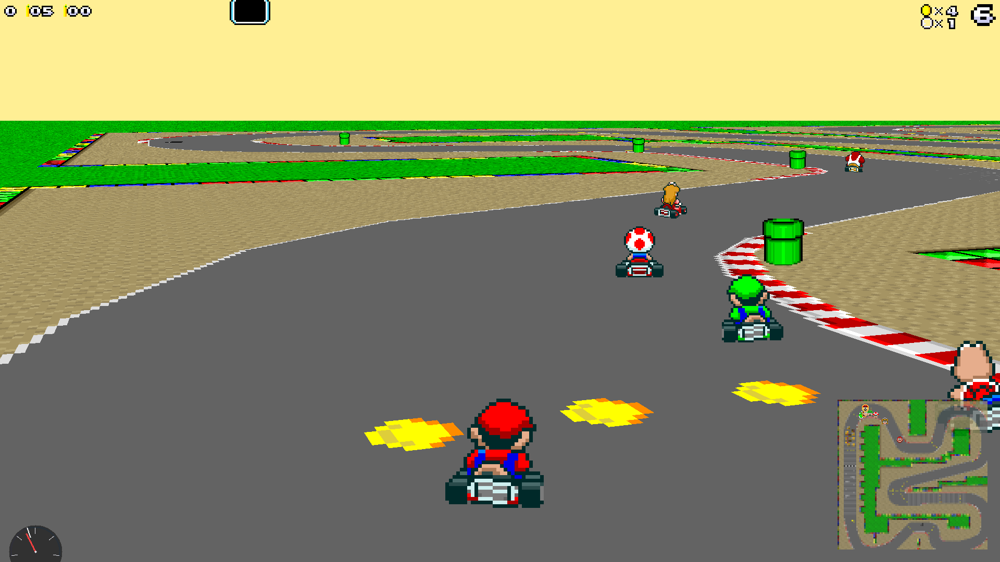
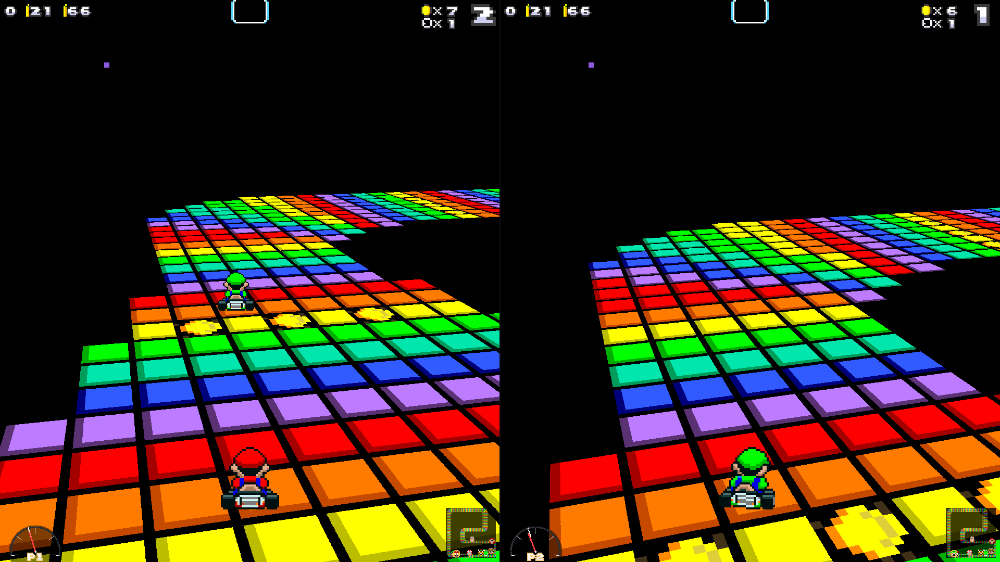

# Super Mario Kart — native reimplementation

A PC executable that runs Super Mario Kart's real courses natively on SDL2.
No emulator, no ROM patching: the game reads its assets out of a Super Mario
Kart (USA) ROM **you supply**, decompresses them in process, and renders them
with its own perspective renderer at any resolution.



**No game data is distributed here.** This repository is code, tools,
formats and addresses. See [`rom/README.md`](rom/README.md) for where the
ROM goes.

It also builds courses of its own.  **Track Studio** (`make studio`) is
an editor where you paint a course, place its objects, pick one of the
game's eight themes and press Build: the tiles, the sector map, the
racing line, the grid and everything the game's own AI, lap rule and
rescue need are generated and validated, the ROM's field is raced round
it, and the course appears under CUSTOM in the game.  One button shares
it as a single file anyone can drop into their tracks folder.  See
[Your own courses](#your-own-courses).

## Build and run

```bash
sudo apt install libsdl2-dev libsdl2-mixer-dev cmake build-essential   # or your equivalent
cp /path/to/your/smk.sfc rom/smk_usa.sfc
make game
make run
```

`./run.sh` does the same in one step.  Both check first that a compiler,
cmake, pkg-config, SDL2, SDL2_mixer and the ROM are there, and name what
is missing with the install command for your package manager
(`tools/deps.sh`) instead of letting cmake fail in its own words.

**Windows.**  The toolchain is [MSYS2](https://www.msys2.org/), and the
build is the same one: install MSYS2, open the **UCRT64** shell from the
Start menu (not the plain MSYS one - `tools/deps.sh` stops you if you
are in the wrong shell, because that one links against MSYS2's POSIX
layer instead of building a Windows binary), and

```bash
pacman -S mingw-w64-ucrt-x86_64-{gcc,cmake,pkgconf,SDL2,SDL2_mixer} git make
make game
make run
```

That is a real `build-native/smk.exe`, not an emulation layer; MSYS2 is
only where the compiler lives.  Copy it out with the SDL2 and SDL2_mixer
DLLs beside it (`ldd build-native/smk.exe` lists them) and it runs on a
machine with no MSYS2 at all.  Lap times and installed courses go to
`%APPDATA%\smk-port` rather than `~/.local/share/smk-port`.  MSVC is not
supported: the port uses POSIX directory reading and a GNU `typeof`, and
MinGW-w64 has both.

**Sound.**  The effects and the engine are decoded from the ROM and play
at once.  The music is not: it is pre-recorded from the game's own sound
driver into `rom/music/` by you ([`docs/SOUND.md`](docs/SOUND.md)), and
it is off until `n` in the race or `SMK_MUSIC=1`.  If a race has no
sound at all, the console says why at start-up: most often SDL found no
audio device because no sound server (PipeWire, PulseAudio) is running
or ALSA's library is missing; `SDL_AUDIODRIVER=pipewire`, `pulseaudio`
or `alsa` picks a backend by hand.

`make run` opens the shell: **title → players → mode → class → driver →
course → race**.  It starts fullscreen; `alt+enter` or F11 toggles, and
`--windowed` starts in a window.

**Grand Prix** runs a cup's five courses in the ROM's order.  After each
race come the times, the points the ROM's table pays the top four
(9, 6, 3, 1) and the championship standings.  The next race lines up in the
order this one finished, winner on pole, as the game does.  Two rules are
ours: finishing fifth or worse scores nothing and the cup goes on (the
original makes you retry), and fifteen seconds after the fourth kart is
home the race ends at the positions held, or the moment everybody is home.
The finishing list, in the game's own face art, fills in as karts finish
and the minimap shows every kart as its face.

**Single Race** is one course with the full field.  **Time Trial** is five
laps alone with one mushroom, a lap clock and splits; the five fastest laps
per course are kept between sessions under
`$XDG_DATA_HOME/smk-port/laptimes.txt`.

```
accelerate      Up or W          hop / drift        Space
brake           Down or S        use the item       Z or Ctrl
steer           Left / Right     pause              Enter
menus           arrows move, Enter selects, Esc back
fullscreen      Alt+Enter or F11 quit               Esc at the title
[  ]            previous / next course  (any race)
m  h  n         toggle the map, the speed dial, the music
o  p  f         cycle the palette, toggle texture filtering
```

A gamepad maps to the SNES pad: A or the right trigger accelerates, X or B
brakes, the shoulders hop, Start pauses.  `./build-native/smk --help` lists
everything.

## Two players

The mode screen has a PLAYERS row: `1P`, `VS CPU` and `VS 2P`.  The split
is **side by side**, left and right, a deliberate departure from the
original's stacked views, and each half's whole sound goes to its own
speaker.  What the menu offers follows what is plugged in: with no
controller `VS 2P` is unavailable, with one it is the controller for
player 1 and the keyboard for player 2, with two it is one each.



**The VS CPU driver is a neural network**: a policy trained by
reinforcement learning in the port's own headless environment and built
into the binary.  It presses the same buttons a person would, through the
same player physics, with no privileged control over its kart.  The
dashboard under the speed dial says who drives each view: `P1`, `P2`,
`NEURAL`, or `AUTO` for the scripted fallback used by a build without
weights.  Details and how to train your own are below.

## Command line

`--track N` (0–19, or a course package's name or directory) skips the shell and drives that course; `--timetrial`
makes it a solo trial; `--class 0|1|2` picks 50, 100 or 150cc;
`--character N` and `--character2 N` choose the drivers; `--players 1|cpu|2`
sets the split.  `--width`, `--height` and `--pixel N` size the render
(`--pixel 1` is native, `--pixel 4` chunky).  `--frames N` runs headless and
exits, `--fast` steps one simulation tick per frame for headless runs,
`--autodrive` lets a scripted driver take player 1 (a test aid, not the
AI), `--shot FILE` renders one frame to a BMP.  `--cpu-policy FILE` swaps
the CPU's network and `--pads FILE` drives player 1 from a policy's own
choices ([`docs/RL.md`](docs/RL.md)).  `--cpu-rules original|fair` is the
class screen's CPU RULES row: FAIR makes the field pay for grass and ramps
and halves its handicap bonus ([`docs/AI.md`](docs/AI.md)).

The renderer is single-threaded software and holds 1920×1080 at the game's
60 Hz on one core.

## What is in

- **All 20 Grand Prix courses**, each in its own theme: tileset, palette
  and surface data from the ROM's own tables, drawn as Mode 7 tiles with
  the game's per-tile palette remapping on a resolution-independent
  perspective plane, at the game's 60.0988 Hz.
- **Kart physics in the ROM's own arithmetic**: 16.16 position, 8.8
  velocity, 65536-unit angle, the integration from `$80879D`, the 32-bit
  speed and acceleration model from `$80A4E1`, the acceleration curves and
  target speeds per class, the surface table, drift, hop, the turbo start
  and the countdown.  Gated by replaying recorded human runs through the
  port frame for frame.  Water: the wade, the sink and Lakitu's fishing,
  measured from recordings; the deep classes drop you on the first frame,
  as the oracle showed the game does, and each fall has the game's own
  sound (the void's, lava's, the deep drop's thud, the skim's, and
  silence for the sink).
- **Seven opponents on the ROM's own racing lines**: its direction field,
  speed classes and rubber band, kart-to-kart contact with the weight
  table, ramp launches, the water skim (measured in the oracle: the
  game's field skims Donut Plains 3's lake onto the bridge), wall
  escapes, Lakitu's rescue.  Their item
  behaviour is the game's: the per-character attack masks, and the hop
  over a floor item with the ROM's own odds (an AI's poison mushroom is
  jumped 30 times in 32 by the karts behind it; your banana one time in
  eight while you lead).
- **Items**: the roulette, the nine items, their projectiles, hits and
  effects, the AI's weapons, decoded from the ROM and measured on the
  running game ([`docs/ITEMS.md`](docs/ITEMS.md)).  A shell on a COM
  shoves it sideways, holds it eight frames and then spins it, with the
  game's sounds.
- **Sound** from the game's own BRR samples by its own ids: the engine
  note and volume laws (rev against speed, halved under water), the
  other karts' engines, the spin whirr on its stolen voice, surfaces,
  hits, the countdown, the voices.  Music is pre-recorded from your own
  ROM and mapped by you ([`docs/SOUND.md`](docs/SOUND.md)); off by
  default, `n` toggles it.
- **The furniture**: the HUD on the game's own art, Lakitu and his
  lights, the flag, the lap sign, Thwomps, moles (the grab's stop and
  climb and the mole riding the kart as the recording shows them),
  cheep-cheeps, piranha plants, pipes, breakable blocks, water and the
  fall, the horizon per theme, the winner's pose, the squash, the shrunk
  kart as the game draws it, the track map, the finishing list and
  standings with the game's faces.
- **The finish**: after the line your kart drives itself, as the
  original's does; once everybody playing is home the results come five
  seconds after the last of them, three of celebration and two of fade.
  A trained CPU driver that wedges itself in a corner hands over to the
  autopilot for five seconds, and the dial says AUTO while it does.
- Karts, objects and effects from the ROM's sprite sheets, with the
  rotation frames and the size ladder measured off the running game.
- **Track Studio and the course engine**: draw a course as roles, place
  boxes, coins, oil, pads, ramps and obstacles, choose the theme, and
  the tool compiles it to the theme's tiles, generates the sector map
  and racing line the ROM's AI drives, validates it, races the field on
  it and starts the game on it; share it as one `.smkt` file with your
  name inside ([`docs/TRACKS.md`](docs/TRACKS.md), the section below).

## Your own courses

The port takes course packages: a directory holding the author's
arrangement of a theme's tiles and the course data the game's own AI,
lap rule and rescue read.  The ROM stays the only source of art.

**The editor** is `make studio` (`tools/trackstudio.py`, tkinter, no
extra packages): paint the road, grass, walls, water and void with a
brush, click boxes, coins, oil, pads, ramps and obstacles into place,
click the start line onto a straight running north (the grid appears
behind it, and Build asks for the line if it is missing), pick the
theme, press *Build and validate*.  The tiles, the sector map, the
racing line, the finish strip and the grid are generated and checked,
the problems are listed, *Race
the AI* has the game's own field lap it at three classes, *Play* starts
the game on it.  A waypoint can be dragged and its AI speed row set
with the keys 0 to 3.

The same pipeline from the command line is `tools/trackgen.py`
([`docs/TRACKS.md`](docs/TRACKS.md)):

    python3 tools/trackgen.py new tracks/mine --theme 1 --name "MY COURSE"
    # draw tracks/mine/roles.txt in any text editor: = road, . grass, # wall,
    # b box, c coin, e obstacle... (S places the start line yourself; else it
    # goes across the longest straight running north)
    python3 tools/trackgen.py build tracks/mine     # tiles, sectors, racing line, lint
    python3 tools/trackgen.py render tracks/mine    # a picture of what you made
    make trackcheck TRACK=tracks/mine               # the field must lap it, on the road

*Share as one file* writes the course as a single `.smkt` (a plain ZIP of
the package, stored uncompressed) with its name and creator inside; drop
it into any tracks folder and the game lists it, the course screen shows
who made it, and the editor opens it with *File > Open a shared file*.
*Scatter coins...* lays a chosen number of coins in small groups round the
lap, and the results panel says when a course has no coins, boxes or
obstacles.

Every package or `.smkt` under `tracks/`, `~/.local/share/smk-port/tracks/` or a
`--track-dir` shows up in a fifth column of the course screen, CUSTOM,
for single races, VS and time trials (a Grand Prix stays on the ROM's
four cups).  `--track tracks/mine` drives one directly, and its best laps
are kept under its own name.  `tracks/oval` is the example the template
draws.

## What is not

- **Battle Mode and its four arenas are not part of this port** and will
  not be.  The arena data is in the ROM and the loader can read it, but
  there is no mode, no balloons and no arena AI.
- The **menus are our own layout** in the ROM's font and palettes, not
  its tilemaps.
- The AI has no per-character personality; the cup's finish (no retry,
  the fifteen second cooldown) is our rule; a few sound ids are captured
  but not wired.

Every shortcut and approximation is a labelled entry in the ledger in
[`docs/ROADMAP.md`](docs/ROADMAP.md), with the measurement that would
close it.  The decode log, entry by entry, is [`docs/NOTES.md`](docs/NOTES.md).

## The neural CPU, and training your own

The port doubles as a headless deterministic RL environment: the same C
the window races, stepped from an action instead of a gamepad, at about
36,000× realtime on one core, with no emulator and no renderer in the
loop.  The shipped VS CPU driver came out of it: a two-layer MLP with 81
inputs, two 256-unit layers and 14 actions, trained with PPO (300 lines of
PyTorch in `tools/rl/`, no framework) across all three engine classes,
alone, against the field and against the field with items, on 16 of the 20
courses with four held out to show it learned to drive rather than twenty
routes.

What it sees is not pixels and not where it is: velocity in its own frame,
the slip angle, the next four waypoints as bearings, its offset from the
racing line, twelve rangefinders, the ROM's direction field, its rank, the
nearest three karts, the item held and the nearest projectile.  No absolute
position, no course identity, no clock, so it cannot memorise a route.  The
weights (`src/netpolicy.inc`, int8 with a float scale per row, 84 KB) are
parameters fitted by gradient descent with no ROM bytes in them.

```bash
make envtest          # the environment's gate, and its throughput
make envcheck         # prove it is frame-for-frame the same game as the window
make train TRACK=0    # PPO on one course; --gp --tracks gp --classes 0,1,2
                      # --holdout 3,11,16,19 is how the shipped one was made
make watch RUN=runs/track0   # watch the CURRENT policy drive in the real window

# race against a policy of your own instead of the built-in one
python3 tools/rl/export_net.py runs/track0/policy.pt -o cpu.net
./build-native/smk --players cpu --cpu-policy cpu.net
make embed-policy NET=cpu.net && make game     # or make it the default
```

The CPU driver is a full player in its own grid slot, going through the
same step as a person's keyboard, deciding once every four frames, the
rate it learned at.  Inference is 30 lines of C (`src/net.c`) with no
runtime to link.  The environment is verified against the SDL game the
hard way: a race driven in the environment is replayed through the game
binary and the kart's position and speed compared on every frame, then all
81 observation numbers are compared at matched frames.  What the ROM
provides and what is ours is set out in [`docs/RL.md`](docs/RL.md).

## The oracle

`tools/smktool/` contains a 65816 interpreter that runs the game's own
code.  It boots the ROM, uploads its sound driver and runs a race, with
NMI, IRQ, scanline timing, an APU handshake stub and the full DSP-1
coprocessor, at the game's own vblank pacing.  That is how the port is
verified: `make verify-physics` drives the real game and checks our
integration against it, and the loaders' output is diffed against the
ROM's own rather than against expectations.  It models DMA, VRAM, CGRAM
and OAM, so the game can draw its own race for inspection; it is not a
general emulator (no background rendering, no SPC700, no HDMA).

The other half of the method is MAME: the user's recordings of the real
game replayed headless with Lua watches and the debugger on the registers
that matter (`tools/labs/mame/`).  Most numbers in the code cite the
recording and the routine they came from.

## Layout

```
include/, src/     the native game (C11 + SDL2)
  rom.c lzc.c      ROM loading, the game's compression codec
  assets.c         pointer tables, tilemap / tileset / palette, tile expander
  mode7.c          perspective ground-plane renderer
  course.c         a course: surfaces, objects, movers, racing line
  kart.c player.c  the kart's physics and the player's state machines
  ai.c             the seven opponents
  item.c projectile.c pickup.c   the roulette, the items in flight, the floor
  audio.c          sound effects and the engine mixer
  menu.c cups.c    the shell and the cup
  env.c            the headless RL environment (docs/RL.md)
  net.c            the CPU driver's forward pass; netpolicy.inc its weights
  main.c           SDL host: window, fixed timestep, input, HUD
tools/             the reverse-engineering toolkit (Python)
  smktool/         rom, disassembler, symbols, codec, graphics, oracle
  labs/            measurement rigs; labs/mame/ the recording replays
  rl/              the RL binding, PPO, and the env-vs-game replay gate
docs/NOTES.md      the decode log      docs/ROADMAP.md   the ledger
docs/AI.md         the opponents       docs/ITEMS.md     the items
docs/RL.md         the environment     docs/SOUND.md     the sound
docs/FINDINGS.md   what the ROM turned out to contain
```

## Verification

```bash
make selftest        # 114 checks through the C code the game actually runs
make test            # 35 checks: ROM identity, disassembler, codec, build loop
make check           # selftest, the AI lapping every course, the replay gates
make roundtrip       # every disassembled instruction reassembles byte-identically
make shots           # a still from all 20 courses
```

The C and Python implementations of the codec and asset layout are
independent and both are tested, so they cannot silently drift apart.

## The reverse-engineering toolkit

```
./tools/smk info                 cartridge, header, vectors
./tools/smk trace --coverage-map how much is understood as code
./tools/smk dis -s '$808000'     annotated 65816 listing
./tools/smk lin '$81E745' -n 20  linear disassembly with explicit M/X
./tools/smk jumptables           discover indirect dispatch tables
./tools/smk assets list          compressed asset inventory
```

The method is written up as a skill in
[`.claude/skills/snes-rom-reverse-engineering/`](.claude/skills/snes-rom-reverse-engineering/SKILL.md).

## Legal

This project contains no Nintendo code or data. It reads a ROM you already
own. Do not commit a ROM or an extracted asset (a sprite sheet, a tilemap, a
sample); the `.gitignore` is set up to prevent it. The two screenshots in
`docs/img/` are ordinary in-game screenshots of the port running and
redistribute nothing.
